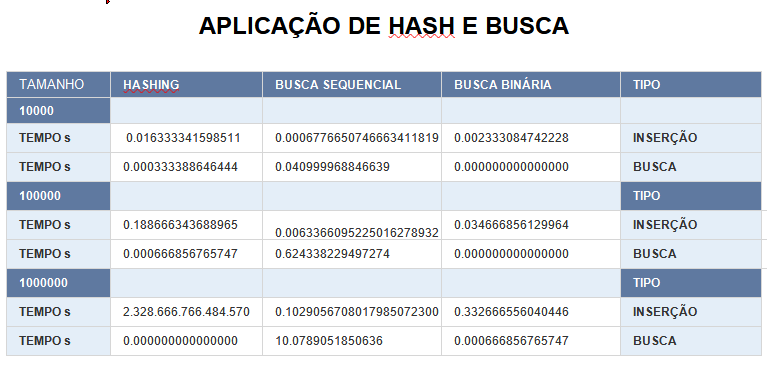

# LEIA-ME: Aplicações de Hashing e Busca

## Grupo: Nichael Filho, Rosilene da Silva Santos e Deivison Delmiro

### Descrição:
Conseguimos realizar todas as tarefas propostas para o projeto. O código foi implementado em Python conforme as especificações solicitadas pelo professor Ricardo e foi capaz de realizar testes de desempenho em diferentes estruturas de dados, obtendo resultados que posteriormente foram analisados e expostos em relatório.

### Funcionalidades:
•	Definição da Classe Pessoa: Define uma classe para representar uma pessoa com atributos como CPF, nome, telefone e senha.

•	Estrutura de Hashing: Implementa uma estrutura de tabela de hashing para armazenar objetos Pessoa. Fornece métodos para inserir e buscar pessoas na tabela de hashing.

•	Estrutura de Busca Binária: Implementa uma estrutura de lista ordenada usando busca binária para armazenar objetos Pessoa. Fornece métodos para inserir e buscar pessoas na lista.

•	Estrutura de Busca Sequencial: Implementa uma estrutura de lista não ordenada para armazenar objetos Pessoa. Fornece métodos para inserir e buscar pessoas na lista.

•	Geração de CPF Aleatório e Dados de Pessoa: Fornece funções para gerar CPFs e dados de pessoas aleatórios para uso nos testes de desempenho.

•	Teste de Desempenho: Realiza testes de desempenho comparando as estruturas de dados em termos de tempo de inserção e busca para diferentes tamanhos de conjunto de dados.

•	Cálculo de Média e Formatação de Tempo: Fornece funções para calcular a média de uma lista de valores e formatar o tempo em um formato legível.

### Utilização:
1.	Definir os dados de entrada (opcional): Se você deseja testar o desempenho das estruturas de dados com dados específicos, pode definir esses dados manualmente no código ou gerá-los aleatoriamente usando as funções fornecidas, como gerar_dados_pessoa().
2.	Instanciar as Estruturas de Dados: Crie instâncias das estruturas de dados que deseja testar, ou seja, Hashing, BuscaBinaria e BuscaSequencial. 
3.	Inserir Dados: Use o método inserir() de cada estrutura de dados para adicionar os dados gerados ou definidos anteriormente.
4.	Realizar Teste de Desempenho: Chame a função testar_desempenho() para testar o desempenho das estruturas de dados inserindo os dados criados e realizando operações de busca.
5.	Analisar Resultados: Os tempos médios de inserção e busca para cada estrutura de dados serão exibidos no console. Você pode analisar esses resultados para comparar o desempenho das estruturas em diferentes cenários.

### Referências:
•	https://panda.ime.usp.br/panda/static/pythonds_pt/05-OrdenacaoBusca/Hashing.html
•	https://www.youtube.com/watch?v=juPjfZ5B5Y8 (Tabela Hash em Python: Introdução e Inserção de Elementos – Ygor Amaral)
•	https://www.youtube.com/watch?v=ahXrJ7qPAoQ (Busca Sequencial em Python – Ygor Amaral)
•	https://panda.ime.usp.br/panda/static/pythonds_pt/05-OrdenacaoBusca/BuscaSequencial.html 
•	https://www.youtube.com/watch?v=7b04fg96aN0 (Busca Binária em Python – Ygor Amaral)
•	https://www.alura.com.br/artigos/busca-binaria-aprenda-implementar-python?utm_term=&utm_campaign=%5BSearch%5D+%5BPerformance%5D+-+Dynamic+Search+Ads+-+Artigos+e+Conte%C3%BAdos&utm_source=adwords&utm_medium=ppc&hsa_acc=7964138385&hsa_cam=11384329873&hsa_grp=111087461203&hsa_ad=687448474447&hsa_src=g&hsa_tgt=dsa-2276348409543&hsa_kw=&hsa_mt=&hsa_net=adwords&hsa_ver=3&gad_source=1&gclid=CjwKCAjwtqmwBhBVEiwAL-WAYSMqBFaLAikHFFFdbgOBvQS6ahVCsTlQBXo_R-7XSe0f5ySsrbUihRoCo6gQAvD_BwE 

### Análise de resultados: 
- Hashing
Tempo de inserção aumentou com o aumento do tamanho do conj de dados, já que precisa lidar com colisões.
O tempo de busca foi estável, idenpendente do tamanho do conj de dados. Isso mostra que tabelas hashing tem complexidade 0(1) em média. 

- Busca binária
Tempo de inserção também aumentou com o tamanho do conj de dados, mas de forma menor do que o hashing. sua busca requer inserção ordenada sendo mais eficiente em termos de busca.
Tempo de busca foi estável, com pouca tendencia de aumento com o tamanho do conj de dados. Isso porque a busca tem complexidade 0(log n), que cresce lentamente com o aumento de n.

- Busca sequencial
Seu tempo de inserção foi mais afetado pelo aumento do tamanho do conj de dados, sendo o mais lento. Não requer ordenação e precisa percorrer toda a lista para inserção.
Já o tempo de busca aumentou com o tamanho do conj de dados, porque a busca sequencial tem complexidade 0(n) já que o tempo de busca aumenta linearmente com o tamanho da lista.

### Padrões:
Hashing tem melhor desempenho de busca em geral, quando tem poucas colisões. Inserção pode ser mais lenta com conj de dados maiores.

Busca binária tem boa combinação de desempenho de inserção principalmente quando os dados estão ordenados. A inserção é mais lenta em comparação com hashing , mas a busca é mais eficiente do que a sequencial.

Busca sequencial apresentou o desempenho de inserção mais lento, principalmente com conj de dados grandes. Em relação a busca é menos eficiente do que as outras estruturas, porque fica mais lenta conforme o conj de dados aumenta.

Comentários finais: 
Ao decidir qual estrutura de dados usar neste projeto, é essencial considerar o tamanho e a natureza dos dados, as operações que serão realizadas com mais frequência (inserção, busca, etc.), os requisitos de memória e as restrições de desempenho. Cada estrutura de dados tem suas vantagens e limitações, e a escolha adequada dependerá das necessidades específicas do projeto.
